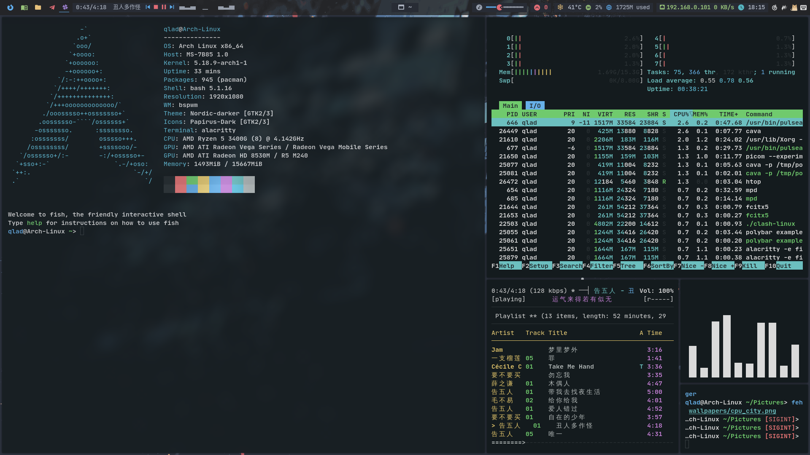

import Bleed from 'nextra-theme-docs/bleed'
import Callout from 'nextra-theme-docs/callout'

<h1 className="text-center font-extrabold md:text-5xl mt-8">qlAD's Arch Linux dotfiles</h1>

qlAD's Arch Linux dotfiles configuration index - built with Vercel and Next.js.

Our strong community is diverse and helpful, and we're proud of Arch's range of skills and uses. ———— Arch Wiki

  [Deploy now](/docs/deploy_now) · [Log record](/blog/log_record) · [GitHub Repository](https://github.com/qlAD/dotfiles)

